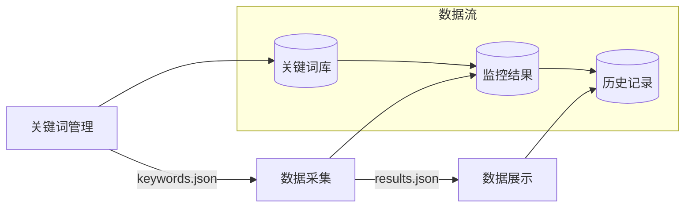

# Google关键词监控系统

## 1. 项目目标
构建一个自动化工具，用于：
1. 监控Google搜索广告的变化
2. 收集整理广告数据
3. 分析竞争对手投放策略

## 2. 核心功能模块

### 2.1 关键词管理
[[关键词管理]] 通过分类系统管理监控关键词，支持批量导入和状态控制。

### 2.2 数据采集
[[数据采集]] 自动获取Google搜索结果，支持多地区数据采集，包括广告信息和落地页截图。

### 2.3 数据展示
[[数据展示]] 使用直观的界面展示监控结果，支持多维度查看和分析数据。主要特点：
- 集成式搜索筛选：结合关键词分类和搜索功能，提供精准的数据筛选
- 交互式数据展示：支持点击关键词快速搜索，动态更新结果
- 多维度数据组织：按市场、分类、时间等维度组织展示数据

## 3. 系统架构

## 4. 数据流转
1. 关键词管理模块维护监控关键词
2. 数据采集模块根据关键词执行监控
3. 数据展示模块实时更新监控结果

## 5. 注意事项
1. 保持界面简单易用
2. 确保数据及时更新
3. 支持批量操作功能
4. 保留历史数据查看
5. 优化搜索和筛选体验

## 6. 迭代计划

### 第一阶段：关键词管理（1周）
- [x] 基础界面搭建
- [x] 关键词分类管理
- [x] 批量导入功能
- [x] 验证功能可用性

### 第二阶段：数据采集（2周）
- [x] 单个关键词采集
- [x] 多地区支持
- [ ] 并发采集优化
- [ ] 验证采集稳定性

### 第三阶段：数据展示（1周）
- [x] 基础数据展示
- [x] 数据筛选功能
- [x] 集成式搜索
- [ ] 历史记录查看
- [ ] 验证展示效果

### 第四阶段：系统优化（1周）
- [ ] 性能优化
- [ ] 错误处理
- [ ] 用户反馈改进
- [ ] 验证整体功能

## 7. 验证方案

### 功能验证
1. **关键词管理**
   - 测试批量导入 100 个关键词
   - 验证分类管理功能
   - 检查状态切换是否生效

2. **数据采集**
   - 验证采集准确性
   - 测试多地区采集
   - 检查并发性能

3. **数据展示**
   - 验证数据实时更新
   - 测试分类筛选功能
   - 测试关键词搜索功能
   - 验证交互响应速度
   - 检查历史记录完整性

### 性能验证
1. **响应时间**
   - 页面加载 < 2秒
   - 数据更新 < 1秒
   - 搜索响应 < 0.5秒
   - 批量操作 < 5秒

2. **并发能力**
   - 支持 10 个并发采集
   - 支持 100 个同时在线
   - CPU 使用率 < 50%
